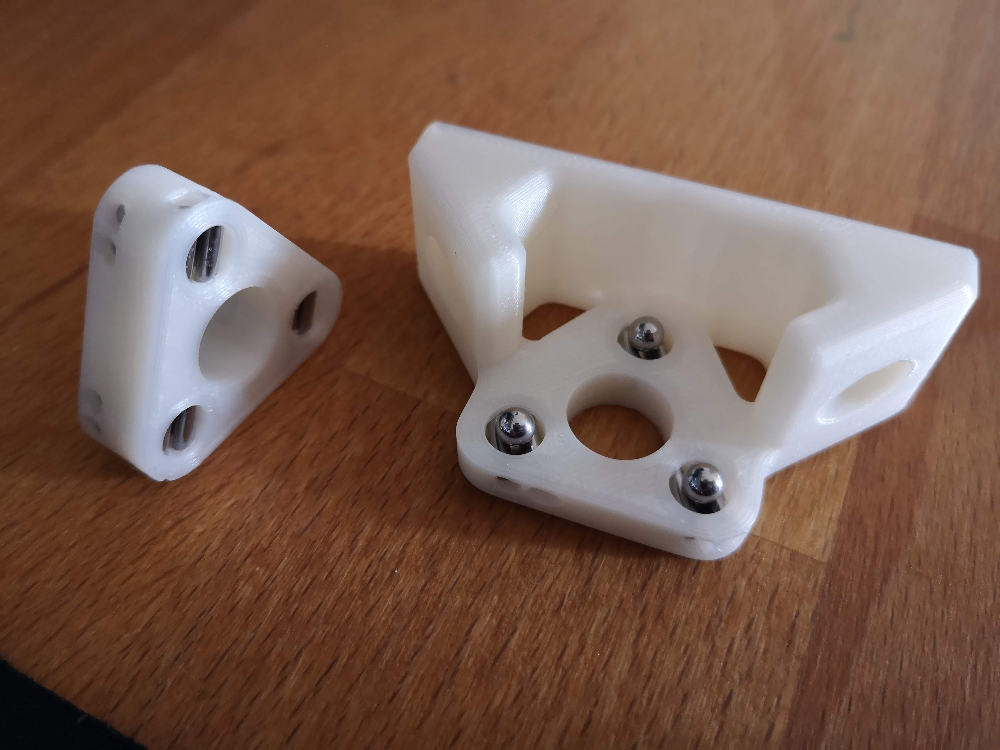

# VzBot-mods

This repository contains projects related to VzBot 3D printer

## Anti wobble for lead screw support

Additional parts:

| Part            | Quantity | Description |
| :---            | :---     |    :--- |
| M3 8mm screw    | 2x       | Used to mount nut from the bottom    |
| 6x3mm magnet    | 9x       |      |
| 4mm steel balls | 6x       |      |
| Metal pins      | 24x      | Length: 8mm, fi: 2mm.  have use cylindrical studs from BOSSARD: 1255622 BOSSARD Ø: 2mm; L: 8mm     |

Assembly:
1. For Bottom and Top part insert all metal pins, and align them correctly. You can use thin allan key to pushed them all the way into small holes on the other side.
2. For middle Part place metal pins on one side.
3. In the middle part, place magnets in the same direction.
4. Close the magnets from the other side with metal pins.
5. Insert magnets in Top and Bottom part in the way that they will be attracted correctly with middle part. All magents needs to attract each other

Shield: [![CC BY-NC-SA 4.0][cc-by-nc-sa-shield]][cc-by-nc-sa]

This work is licensed under a
[Creative Commons Attribution-NonCommercial-ShareAlike 4.0 International License][cc-by-nc-sa].

[![CC BY-NC-SA 4.0][cc-by-nc-sa-image]][cc-by-nc-sa]

[cc-by-nc-sa]: http://creativecommons.org/licenses/by-nc-sa/4.0/
[cc-by-nc-sa-image]: https://licensebuttons.net/l/by-nc-sa/4.0/88x31.png
[cc-by-nc-sa-shield]: https://img.shields.io/badge/License-CC%20BY--NC--SA%204.0-lightgrey.svg
